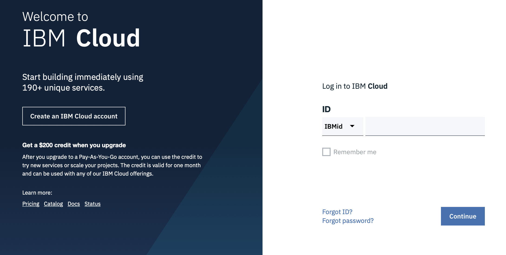
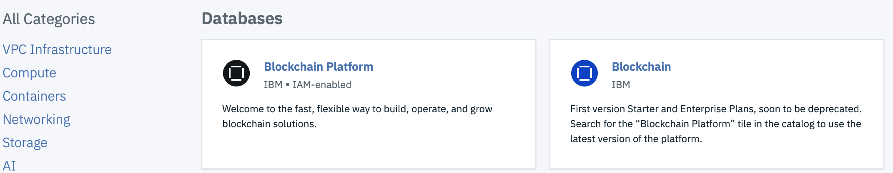

# Event URL: [https://bit.ly/2LR2WP0](https://bit.ly/2LR2WP0)

# The Beginning.

It all started in October during the Global Financial Crisis in 2008 with Satoshi Nakamoto and his paper [BitCoin: A Peer-to-Peer Electronic Cash System](https://bitcoin.org/bitcoin.pdf) which addressed a key problem in electronic commerce:

<i><b>
A purely peer-to-peer version of electronic cash would allow online payments to be sent directly from one party to another without going through a financial institution. 

 
Digital signatures provide part of the solution, but the main benefits are lost if a trusted third party is still required to prevent double-spending. 

We propose a solution to the double-spending problem using a peer-to-peer network.</i></b> 

Since then Bitcoin anda Blockchain have inhabited two seperate worlds. 
 
Until now...
 
# News! 
 
## IBM World Wire:  
[IBM World Wire](https://www.ibm.com/blockchain/solutions/world-wire)

Introducing IBM Blockchain World Wire, the new financial rail that simultaneously clears and settles cross-border payments in near real-time. Integrating with your existing payment systems, you’ll replace costly opacity with affordable transparency – and that can bring greater financial opportunity to all.
 
## Facebook Libra: 
[Libra White Paper](https://libra.org/en-US/white-paper/)

## Hyperledger FabToken:
https://hyperledger-fabric.readthedocs.io/en/latest/token/FabToken.html
Representing assets as tokens allows you to use the blockchain ledger to establish the unique state and ownership of an item, and transfer ownership using a consensus mechanism that is trusted by multiple parties. As long as the ledger is secure, the asset is immutable and cannot be transferred without the owners consent.

Tokens can represent tangible assets, such as goods moving through a supply chain or a financial instrument being traded. Tokens can also represent intangible assets such as loyalty points. Because tokens cannot be transferred without the consent of the owner, and transactions are validated on a distributed ledger, representing assets as tokens allows you to reduce the risk and difficulty of transferring assets across multiple parties.  

Hiding in section 5.1 is a most important paragraph in the recent Hyperledger Fabric paper. This describes FABCOIN now renamed to FABTOKEN which is a UTXO (Unspent Transaction Output) Token for Fabric. This little thing has 3 huge implications:-

1.    Ethereum Interoperability – along with Hyperledger Burrow, Fabcoin will let Smart Contracts written for the Ethereum Virtual Machine run on Hyperledger Fabric.

2.    Behavioural change – blockchain is best suited to driving large scale decentralised change on the micro or very small level. These little things – like Internet of Things interactions or writing a blog or picking up a piece of plastic rubbish – need new business models and new incentive models.   You can’t incentivise these changes in pounds, shillings and pence – you need a Token for that.  

3.    Collapsing Supply Chains – smart contracts allow the elimination of Accounts Receivable and Payable. The end of “mirrored” transactions like purchase and sales orders, Purchase and Sales Invoices and Payments and Receipts. A token can be used like an intercompany transaction at the micro level with instant transfer of value financed in some way. The token can be linked to reputation services (to Tier 1, Tier 2 and Tier 3) with an end of cycle (once the end consumer pays) settlement in fiat cash. Additionally, new business models can be used to extend the token to change behaviour to support, for example a circular economy.   

https://www.linkedin.com/pulse/token-hyperledger-fabric-andy-martin/

IBM is taking its banking clients a step closer to cryptocurrency.

Announced Monday, six international banks have signed letters of intent to issue stablecoins, or tokens backed by fiat currency, on World Wire, an IBM payment network that uses the Stellar public blockchain. The network promises to let regulated institutions move value across borders – remittances or foreign exchange – more quickly and cheaply than the legacy correspondent banking system.

....

The network went live Monday, although while the banks await their regulators’ blessings, the one stablecoin running on World Wire at the moment is a previously announced U.S. dollar-backed token created by Stronghold, a startup based in San Francisco. “We say ‘limited production,’” said Jesse Lund, IBM’s head of blockchain for financial services, of the project’s status.

Indeed, while Stronghold’s USD-backed coin currently serves as an on-ramp for greenbacks, there are as yet no pay-in/pay-out locations in the U.S.  In this regard, IBM has received “a favorable verbal response” from U.S. regulators, said Lund.

“So we are starting with markets that are outside of the U.S., but it won’t be long before we add U.S. as an operating endpoint. It will be sometime this year; we will get to it, third quarter, fourth quarter something like that,” he said.

Still, the World Wire platform has payment locations in 72 countries, with 48 currencies and 46 “banking endpoints” (which include banks and money transmitters) where people can send or receive cash, said IBM.

Aside from issuing their own tokens, the arrangement opens up the possibility of banks using lumens, the native token of the Stellar blockchain, which can be used as a “bridge currency” when it is hard to trade one type of fiat for another. Also, World Wire “could support other cryptos” but is only supporting lumens for the moment because financial institutions are put off by the volatility of cryptocurrencies, Lund said....

https://www.coindesk.com/ibm-signs-6-banks-to-issue-stablecoins-and-use-stellars-xlm-cryptocurrency

# An introduction to the IBM Blockchain Platform 2.0!

# Contacts:

## Linkedin.com/in/lennartfrantzell/
## Linkedin.com/in/drnugent/
 

# Learning Objectives:

## 1. How do we get started?
 
## 2. Visual Studio Code with the IBM plugin, creating our MVP

## 3. How do we deploy our MVP in the <a href="https://ibm.biz/Bdzmec">IBM Cloud </a> 

# Learning Objective 1: How do we get started?

## Knowing who we are (developers, business people, entrepreneurs ..) 
## Who do we need to recruit for our team? One architect, one business person, two developers, one operations person.
## Understand that Blockchain is an enterprise techology that deals with the operation of ledgers and business networks where architecture, security and cryptography play importat roles. 
## Lets take a look: [Transparency from farm to cup](https://www.ibm.com/thought-leadership/blockchainbean/)

## Planning: Agile and the [IBM Garage Method](https://www.ibm.com/cloud/garage/method) 
## [IBM Garage: Blockchain for trusted transactions](https://www.ibm.com/cloud/garage/architectures/blockchainArchitecture/reference-architecture)
## [Use Cases](https://www.ibm.com/blockchain/use-cases/) or how do we start?
## Into the world of architecture: Cloud, security <a href="https://www.ibm.com/support/knowledgecenter/en/SSBS6K_3.1.0/featured_applications/ibm_blockchain_platform.html">IBM Blockchain Platform for IBM Cloud Private</a>
## It is all about data: <a href="https://developer.ibm.com/articles/cl-extend-blockchain-smart-contracts-trusted-oracle/on-chain"> on-chain, off-chain and oracles</a>
## [Performance](https://www.hyperledger.org/blog/2019/04/04/does-hyperledger-fabric-perform-at-scale)
## Agile and define and implement our Minimum Viable Product
### Create the actors 
### Create the data
### Create the Smart Contracts (Create, Query, Update)
### Create the Business Network
### [Ivan Vankov: Main Three Components of Hyperledger Fabric: Fabric CA, Fabric Peer and Fabric Orderer](https://www.youtube.com/watch?v=CsauV-9zHAk)
~~~~
===> hyperledger/fabric-ca                                                                                                                      
hyperledger/fabric-tools                                                                                                           
hyperledger/fabric-ccenv                                                                                                               
===> hyperledger/fabric-orderer                                                                                                         
===> hyperledger/fabric-peer                                                                                                            
hyperledger/fabric-javaenv                                                                                                                          
hyperledger/fabric-zookeeper                                                                                                        
hyperledger/fabric-kafka                                                                                                           
hyperledger/fabric-couchdb                                                                                                         
hyperledger/fabric-baseimage                                                                                                       
hyperledger/fabric-javaenv                                                                                                           
hyperledger/fabric-tools                                                                                                            
hyperledger/fabric-baseos                                                                                                          
~~~~

### Create the architecture:

## [Orderers and the transaction flow](https://hyperledger-fabric.readthedocs.io/en/release-1.4/orderer/ordering_service.html)

### [Phase one: Proposal](https://hyperledger-fabric.readthedocs.io/en/release-1.4/orderer/ordering_service.html#phase-one-proposal)

### [Phase two: Ordering and packaging transactions into blocks](https://hyperledger-fabric.readthedocs.io/en/release-1.4/orderer/ordering_service.html#phase-one-proposal)

### [Phase three: Validation and commit](https://hyperledger-fabric.readthedocs.io/en/release-1.4/orderer/ordering_service.html#phase-one-proposal)

### [Ordering service implementations](https://hyperledger-fabric.readthedocs.io/en/release-1.4/orderer/ordering_service.html#phase-one-proposal)

## [Ordering service implementations](https://hyperledger-fabric.readthedocs.io/en/release-1.4/orderer/ordering_service.html#ordering-service-implementations)

###[Solo](https://hyperledger-fabric.readthedocs.io/en/release-1.4/orderer/ordering_service.html#solo)
###[Kafka](https://hyperledger-fabric.readthedocs.io/en/release-1.4/orderer/ordering_service.html#kafka)
###[Raft](https://hyperledger-fabric.readthedocs.io/en/release-1.4/orderer/ordering_service.html#raft-concepts)

### Create the Ledger
### And deploy in the cloud.

It is all about business networks and shared ledgers
  

# Learning Objective 2: Visual Studio Code with the IBM plugin, creating our MVP

### [Installing Visual Studio Code](https://code.visualstudio.com)

### [Installing IBM Blockchain Platform Plugin in Visual Studio Code](https://marketplace.visualstudio.com/items?itemName=IBMBlockchain.ibm-blockchain-platform)

[An introduction to programming Hyperledger Fabric on SlideShare](https://www.slideshare.net/LennartF/ibp-technical-introduction)

[IBM Blockchain Platform on SlideShare](https://www.slideshare.net/LennartF/ibm-blockchain-platform-explained-149106072)

[IBM Blockchain Solutions on SlideShare](https://www.slideshare.net/LennartF/ibm-blockchain-solutions-149098151)

[Complete instructions: Install IBM Blockchain Platform VS Code extension for free](https://cloud.ibm.com/docs/services/blockchain?topic=blockchain-develop-vscode#develop-vscode-install)

Go through Tutorial One in VS Code: Local Smart Contract Development.

Follow the typical workflow from generating a new smart contract project, deploying code to the <i>local_fabric_runtime</i> and testing your transactions via an application gateway</i> 
 

 
# Learning Objective 3: How do we deploy our MVP in the IBM Cloud </a> 

 
## Global Hybridcloud deployment 

### [About IBM Blockchain Platform for Multicloud](https://cloud.ibm.com/docs/services/blockchain?topic=blockchain-console-icp-about#console-icp-about-offers)

### [What IBM Blockchain Platform for IBM Cloud Private offers](https://cloud.ibm.com/docs/services/blockchain?topic=blockchain-console-icp-about#console-icp-about-offers)

You can use this offering to install the IBM Blockchain Platform console on a deployment of IBM Cloud Private. You can then use the console to create all of the fundamental components of a Hyperledger Fabric blockchain, a Certificate Authority, an ordering service, and peers, on your local cluster. For more information about the building blocks of Hyperledger Fabric networks, see the blockchain component overview. You can also use your console to operate a distributed multicloud network by importing nodes deployed on other IBM Cloud Private clusters or on IBM Cloud.

### Free IBM Cloud sign-up link: [https://ibm.biz/BdzPVW](https://ibm.biz/BdzPVW)

### [For instructions on how to apply the codes, review this page](https://cloud.ibm.com/docs/account?topic=account-codes#codes)

### IBM Cloud Catalog link: [https://cloud.ibm.com/catalog/](https://cloud.ibm.com/catalog)

### 1) Find IBM Blockchain Platform service in the IBM Cloud: [https://cloud.ibm.com/catalog?search=blockchain](https://cloud.ibm.com/catalog?search=blockchain). 

IAM Enabled= "Identity and Access Management"

### 2) Launch <a href="https://ibm.biz/Bdzmec">IBM Blockchain Platform Service</a>

### 3) Welcome to the IBM Blockchain platform

### 4) Deploy the IBM Blockchain Service on the IKS. 

### 5) Your Cluster has been connected

### 6) IBM Blockchain Platform Console installed in IBM Cloud.

### 7) [Deploy your Hyperledger Fabric App on AWS](https://aws.amazon.com/blogs/database/build-and-deploy-an-application-for-hyperledger-fabric-on-amazon-managed-blockchain/)

# Appendix 

<a href="https://developer.ibm.com/series/ibm-blockchain-platform-console-video-series/">IBM Blockchain Platform Console Video Series. Follow along this four part series to set up a business network on the IBM Blockchain Platform</a>

<a href="https://developer.ibm.com/videos/deploy-a-peer-on-the-ibm-blockchain-platform/">Deploy a Peer on the IBM Blockchain Platform</a>

<a href="https://developer.ibm.com/videos/deploy-an-ordering-service-on-the-ibm-blockchain-platform/">Deploy an Ordering Service on the IBM Blockchain Platform</a>

<a href="https://developer.ibm.com/videos/create-and-join-a-channel-on-the-ibm-blockchain-platform/">Create and join a channel on the IBM Blockchain Platform</a>

### [Build a Network Tutorial with the IBM Blockchain Platform ](https://cloud.ibm.com/docs/services/blockchain/howto?topic=blockchain-ibp-console-build-network#ibp-console-build-network-sample-tutorial)

## Debugging NPM

1. The application uses Node.js and can sometimes get the wrong version of Node.
1. If npm install gets errors,
1. do: npm rebuild, npm install
1. And if that doesn't work, do:
1. nvm use 8.12.0 npm install or nvm use 8.12.0 npm rebuild npm install
1. the same if npm start gets errors
1 You can also do the same if Visual Studio Code console, Local Fabric Ops pane, do Teardown and Restart Fabric Runtime
1. If you get an error can't find xcode, do xcode-select --install

## Where do we go from here? 

[Creating a basic Blockchain network using the IBM Blockchain Platform V2.0](https://github.com/IBM/Create-BlockchainNetwork-IBPV20)

[SmartContract Trading using IBM Blockchain Platform Extension for VSCode (supports Fabric 1.4](https://github.com/IBM/SmartContractTrading-wFabric1-4-VSCodeExt)
 
[Build a blockchain insurance app](https://developer.ibm.com/patterns/build-a-blockchain-insurance-app/)

[IBM Developer SF Bay Area](https://www.meetup.com/IBM-Developer-SF-Bay-Area-Meetup/)

[IBM SF Bay Area Meetups](https://www.meetup.com/IBM-Developer-SF-Bay-Area-Meetup/events/)
  
## News

[Does Hyperledger Fabric perform at scale?](https://www.ibm.com/blogs/blockchain/2019/04/does-hyperledger-fabric-perform-at-scale/)

[Forbes: Blockchain Goes To Work At Walmart, Amazon, JPMorgan, Cargill and 46 Other Enterprises](https://www.forbes.com/sites/michaeldelcastillo/2019/04/16/blockchain-goes-to-work/#3aa207de2a40)

[Cargill Hyperledger Grid](https://www.cargill.com/2019/cargill-invests-digital-engineering-to-support-hyperledger-grid)

[Target Blockchain for Supply Chain](https://www.coindesk.com/retail-giant-target-is-working-on-a-blockchain-for-supply-chains)

[Why new off-chain storage is required for blockchains](https://www.ibm.com/downloads/cas/RXOVXAPM)

## IBM Blockchain Twitter feeds:

Jerry Cuomo IBM Fellow and CTO, instigator of Blockchain: https://twitter.com/jerrycuomo

Christopher Ferris. IBM Fellow CTO Open Technology https://twitter.com/christo4ferris

Arnaud J Le Hors. Senior Technical Staff Member: https://twitter.com/lehors

Christian Cachin Swiss Cryptographer, Zurich. https://twitter.com/cczurich?lang=en

IBM Blockchain: https://twitter.com/ibmblockchain?lang=en

Mark Parzygnat.Program Director IBM Blockchain: https://twitter.com/meetmarkp?lang=en

## Let's start with Hyperledger:

1. #### [https://github.com/hyperledger/](https://github.com/hyperledger/)
1. #### [Hyperledger Fabric Now Supports Ethereum](https://www.hyperledger.org/blog/2018/10/26/hyperledger-fabric-now-supports-ethereum)
1. #### [Cargill Hyperledger Grid for Supply Chain solutions](https://www.hyperledger.org/projects/grid)
1. #### [Hyperledger Caliper Benchmark tool](https://www.hyperledger.org/projects/caliper)
1. #### [Hyperledger Quilt  offers interoperability between ledger systems by implementing the Interledger protocol ](https://www.hyperledger.org/projects/quilt)
1. #### [Hyperledger URSA a shared cryptographic library](https://www.hyperledger.org/projects/ursa)

### [Hyperledger Fabric 1.4.1](https://hyperledger-fabric.readthedocs.io/en/release-1.4/index.html)

Enterprise grade permissioned distributed ledger platform that offers modularity and versatility for a broad set of industry use cases.

1. [Hyperledger Fabric’s First long term support release](https://hyperledger-fabric.readthedocs.io/en/release-1.4/whatsnew.html#raft-ordering-service)

1. [Raft ordering service](https://hyperledger-fabric.readthedocs.io/en/release-1.4/whatsnew.html#raft-ordering-service) 
    Fault Tolerance consensus algorithm    

## Whitelisting

[Whitelisting](https://cloud.ibm.com/registration/whitelist).
